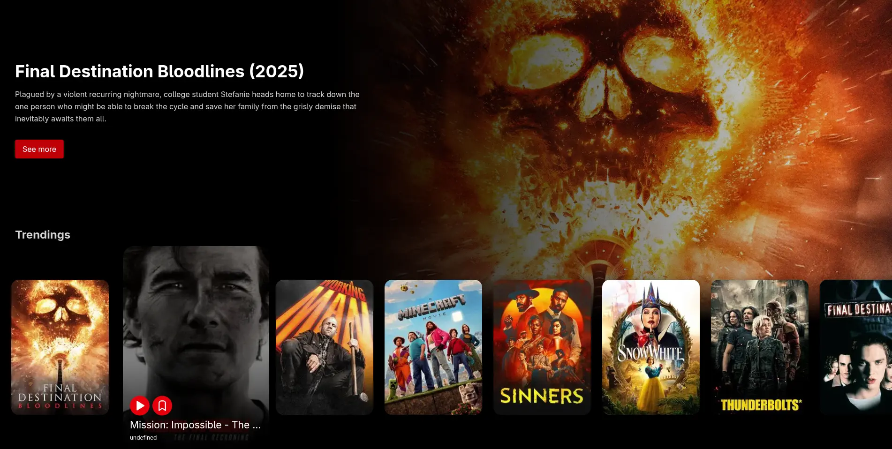

<div align="center">
   
  <h3>Metflix, a Netflix clone</h3>
  <p>Created for didactic and educational purposes.</p>
</div>

<div align="center">
    <a href="https://metflix-ten.vercel.app" target="_blank">
        Preview
    </a>
    <span>&nbsp;✦&nbsp;</span>
    <a href="#-stack">
        Getting Started
    </a>
    <span>&nbsp;✦&nbsp;</span>
    <a href="#-commands">
        Commands
    </a>
    <span>&nbsp;✦&nbsp;</span>
    <a href="#-license">
        License
    </a>
    <span>&nbsp;✦&nbsp;</span>
</div>

<p></p>
<div align="center">


</div>

## ⚒️ Stack

- [**Astro**](https://astro.build/) - The web framework for content-driven websites.
- [**Typescript**](https://www.typescriptlang.org/) - JavaScript with syntax for types.
- [**Tailwindcss**](https://tailwindcss.com/) - A utility-first CSS framework for rapidly building custom designs.
- [**@midudev/tailwind-animations**](https://github.com/midudev/tailwind-animations) - Extended animation utilities for Tailwind CSS.
- [**@justinribeiro/lite-youtube**](https://github.com/justinribeiro/lite-youtube) - The fastest little YouTube web component on this side of the internet.

## 💡 Key Features

- Infinite scroll with `IntersectionObserver`.
- Lazy loading of images in the hero to avoid new downloads in http requests.
- Custom reactive signals with subscribers for rendering.
- DOM observation with `MutationObserver` for dynamic event handling.
- Responsive carousel with smooth animations.

## 🚀 Getting Started

1. [Fork](https://github.com/JhonRomero26/metflix/fork) or clone this repository.

```bash
git clone git@github.com:JhonRomero26/metflix.git
```

2. Install the dependencies:

- We use [pnpm](https://pnpm.io/) to install and manage the dependencies.

```bash
# Install pnpm for MacOS, WSL & Linux:
curl -fsSL https://get.pnpm.io/install.sh | sh -

# Install pnpm for Windows:
Invoke-WebRequest https://get.pnpm.io/install.ps1 -UseBasicParsing | Invoke-Expression

# Install dependencies:
pnpm install
```

3. Run the development server:

```bash
# Run with pnpm:
pnpm dev
```

4. Open [**http://localhost:4321**](http://localhost:4321/) with your browser to see the result 🚀

### 🤝 Contributing

<a href="https://github.com/JhonRomero26/metflix/graphs/contributors">
  
</a>

## 🧞 Commands

|     | Command          | Action                                        |
| :-- | :--------------- | :-------------------------------------------- |
| ⚙️  | `dev` or `start` | Starts local dev server at `localhost:3000`.  |
| ⚙️  | `build`          | Build your production site to `./dist/`.      |
| ⚙️  | `preview`        | Preview your build locally, before deploying. |

## 🔑 License

[MIT](#) - Created by [**jhonromero26.vercel.app**](https://jhonromero26.vercel.app).
